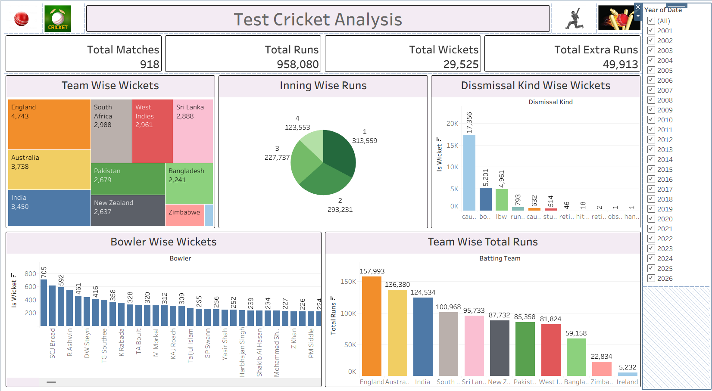

# 🏏 Test Cricket Analytics Dashboard (2001–2026)

An interactive analytics dashboard built using **Tableau** to explore ball-by-ball and match-level trends across over two decades of international Test cricket. The project analyzes team performance, bowling efficiency, dismissal types, and innings progression across 918 matches.

---

## 📊 Dashboard Overview



### Key Metrics Tracked
* **Matches Analyzed:** 918
* **Total Runs Scored:** 958,080
* **Total Wickets Taken:** 29,525
* **Total Extras Conceded:** 49,913

---

## 🔍 Key Insights & Visualizations

1. **Inning-Wise Run Distribution (Pie Chart)**
   * **Innings 1:** 313,559 runs (~32.7%)
   * **Innings 2:** 293,231 runs (~30.6%)
   * **Innings 3:** 227,737 runs (~23.8%)
   * **Innings 4:** 123,553 runs (~12.9%)
   * *Takeaway:* Run production degrades significantly across match progression, reflecting pitch deterioration and lower Fourth-Innings targets.

2. **Team-Wise Performance (Treemap & Bar Chart)**
   * **Most Runs:** England (157,993 runs), Australia (136,380 runs), and India (124,534 runs) dominate total scoring volume due to match frequency and competitive longevity.
   * **Most Wickets:** England leads with 4,743 wickets, followed by Australia (3,738) and India (3,450).

3. **Leading Wicket-Takers (Bar Chart)**
   * Paced by Stuart Broad (705 wickets) and Ravichandran Ashwin (592 wickets), followed by Dale Steyn (461) and Tim Southee (416).

4. **Modes of Dismissal**
   * **Caught:** 17,356 dismissals (~58.8% of all dismissals)
   * **Bowled:** 5,201 dismissals (~17.6%)
   * **LBW:** 4,961 dismissals (~16.8%)
   * Combined, these three modes account for over 93% of all Test dismissals.

---

## 🛠️ Tools & Technologies Used

* **Visualization:** Tableau Desktop / Tableau Public
* **Data Processing:** Python (Pandas) / SQL
* **Data Source:** Ball-by-ball historical international cricket archives (Cricsheet)

---

## 📂 Repository Structure
```text
├── data/
│   └── Test_cricket_data.zip     # Compressed dataset (extract to access CSV)
├── tableau/
│   └── Dashboard Test cricket analysis.twb # Packaged Tableau workbook
├── images/
│   └── Test_cricket_analysis_dashboard.png     # Dashboard screenshot
└── README.md
